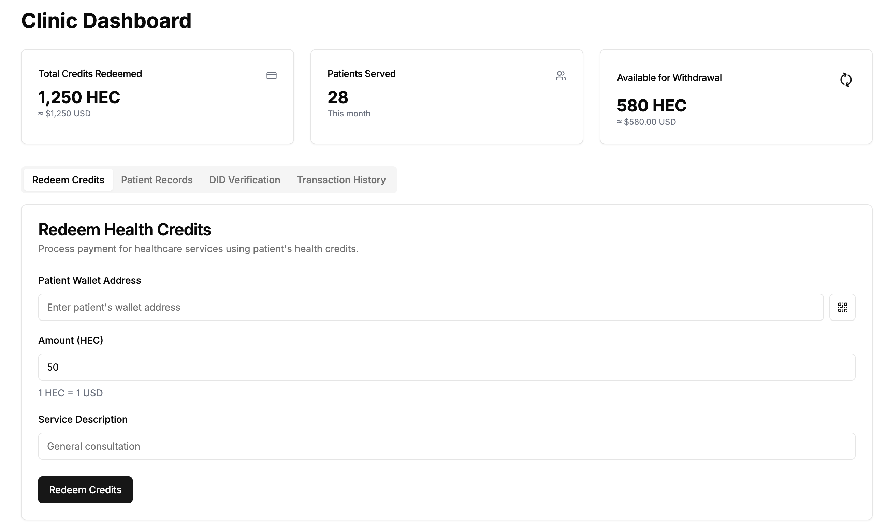

# HealthPay - Healthcare Payment System on XRP Ledger


## 📱 Demo Video
[](https://youtu.be/YOUR_VIDEO_ID)

## 🖥️ UI Screenshots

### Role-Based Dashboards

*Issuer dashboard for token governance and minting*


*Worker dashboard for healthcare service recipients*


*Clinic dashboard for healthcare service providers*

## 🔗 XRP Ledger Integration

### Technical Implementation
HealthPay implements a custom Health Coin (HEC) on the XRP Ledger with the following features:

1. **Token Configuration**
   - Custom IOU with Clawback flag
   - RequireAuth for whitelisting
   - DefaultRipple for efficient routing
   - Freeze capability for risk management

2. **Trust Line Management**
   - Automated trust line creation
   - Two-way trust line authorization
   - Role-based trust line limits
   - Real-time balance updates

3. **Transaction Processing**
   - 4-second finality
   - Sub-penny transaction fees
   - WebSocket subscriptions for live updates
   - Multi-sig authentication via XUMM

### Block Explorer
View our testnet transactions: [HealthPay on XRPL Testnet](https://testnet.xrpl.org/accounts/rzZgrzU4GzbB6jNVHCq3NmufYpQWGW7Ci)

## 🎥 Project Walkthrough
[](https://www.loom.com/share/YOUR_LOOM_VIDEO_ID)

In this video, we demonstrate:
1. Project architecture and code structure
2. XRP Ledger integration details
3. Live demo of all features
4. Security implementation
5. Transaction flow explanation

## 🏗️ Project Structure

healthpay-app/
├── app/ # Next.js application
│ ├── api/ # API routes
│ ├── dashboard/ # Role-based dashboards
│ │ ├── issuer/ # Issuer dashboard
│ │ ├── worker/ # Worker dashboard
│ │ └── clinic/ # Clinic dashboard
│ ├── hec/ # HEC token interface
│ └── components/ # Reusable components
├── lib/ # Core functionality
│ ├── xrpl-service.ts # XRPL integration
│ └── auth-service.ts # Authentication
├── scripts/ # Setup and utility scripts
│ └── hec/ # HEC token scripts
└── public/ # Static assets


## 🚀 Getting Started

### Prerequisites
- Node.js (v16 or higher)
- npm or yarn
- XRP Ledger testnet account

### Installation

1. Clone the repository:
```bash
git clone https://github.com/yourusername/healthpay-app.git
cd healthpay-app
```

2. Install dependencies:
```bash
npm install
```

3. Set up environment variables:
```bash
cp .env.example .env
```

4. Start the development server:
```bash
npm run dev
```

## 💻 Technical Features

### Frontend
- Next.js 14 with App Router
- Tailwind CSS for styling
- Real-time WebSocket updates
- Role-based access control

### Backend
- XRP Ledger integration
- Custom HEC token implementation
- Trust line management
- Transaction processing

### Security
- Multi-signature authentication
- Trust line authorization
- Clawback capability
- Freeze functionality

## 🔄 Transaction Flow

1. **Minting**
   - Issuer mints HEC tokens
   - Tokens are backed by RLUSD
   - Trust lines are automatically set up

2. **Distribution**
   - Operator distributes to Beneficiaries
   - Real-time balance updates
   - Transaction confirmation

3. **Payment**
   - Beneficiary pays Clinic
   - 4-second settlement
   - Transaction history tracking

## 📈 Future Roadmap

### Short Term
- Enhanced UI/UX
- Additional role types
- Mobile app development

### Long Term
- Insurance integration
- Cross-border payments
- Smart contract automation
- Healthcare provider network

## 🤝 Contributing

1. Fork the repository
2. Create your feature branch
3. Commit your changes
4. Push to the branch
5. Create a Pull Request

## 📝 License

This project is licensed under the MIT License - see the [LICENSE](LICENSE) file for details.

## 📞 Contact

For questions or support, please open an issue in the GitHub repository.
